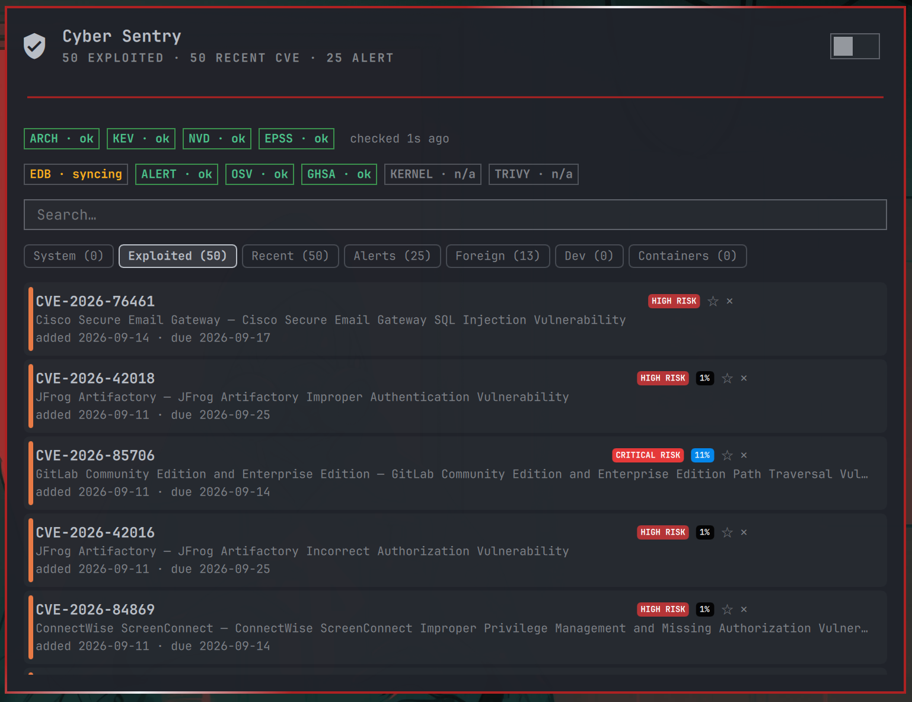
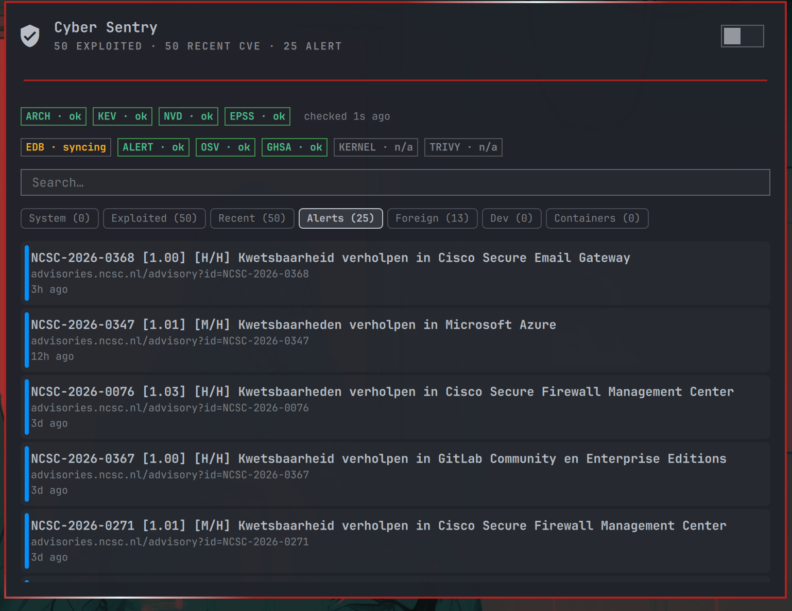
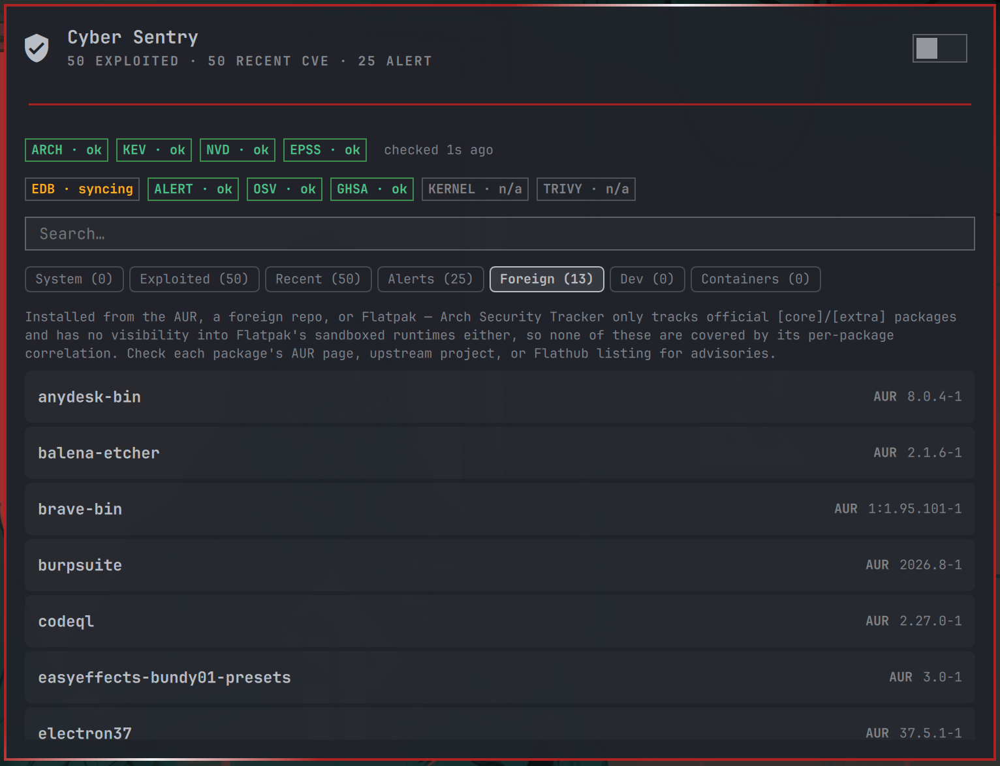
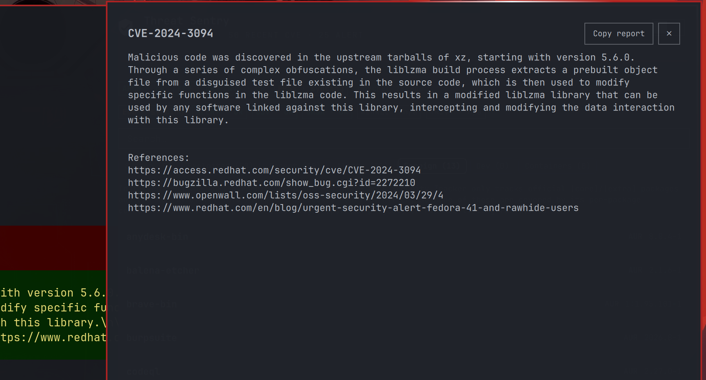

# Cyber Sentry

A [Quickshell](https://quickshell.outfoxxed.me/) / [Omarchy](https://omarchy.org/) bar widget that answers the one question every developer asks after reading a headline about a CVE: **does this affect my machine?**

It correlates live security data against the packages actually installed on this machine (`pacman -Q`) and shows you what matters — not noise.

## Screenshots

<p align="center">
  
  
  
  
</p>

## What it watches

| Source | What it tells you |
|---|---|
| **Arch Security Tracker** | Advisories for your installed packages — only those with a version *below* the fixed version, or with no fix released yet. Stale/"past vulnerable" entries that no longer apply are silently excluded. |
| **CISA KEV** | Every vulnerability the U.S. government's CISA knows is being actively exploited in the wild, updated as new entries are added. Cross-checked against your installed packages with a fuzzy vendor/product match. |
| **NVD (recent)** | Recently published High/Critical CVEs from the National Vulnerability Database's REST API. |
| **GHSA (recent)** | Recent High/Critical GitHub Security Advisories, merged into the Recent tab alongside NVD (deduplicated by CVE) — often lands days before NVD enriches the matching CVE, and is the canonical source for ecosystem/Actions advisories that never get a CVE at all. |
| **EPSS** | Exploit-probability scores enriching every CVE-bearing row, so you can tell "technically vulnerable" from "actually likely to be exploited." |
| **ExploitDB** | Flags rows that have a known public exploit on file. |
| **NCSC-NL Alerts** | Vendor security advisories from the Dutch National Cyber Security Centre. |
| **cve.org** | On-demand detail lookup: click any row to pull the full CVE description, severity score, and references. |
| **OSV.dev** | Scans your globally-installed pip/npm/cargo/go packages against OSV.dev's vulnerability database — coverage Arch Security Tracker can't provide, since it only tracks official Arch packages. |

## AUR / Flatpak coverage

Arch Security Tracker only tracks official `[core]`/`[extra]` repo packages — it
has no per-package/per-version correlation for anything installed from the AUR,
another foreign repo, or Flatpak (a completely separate, sandboxed package
system outside pacman entirely). Cyber Sentry surfaces that gap explicitly with
a dedicated **Foreign** tab listing every AUR/foreign-repo package
(`pacman -Qm`) and every installed Flatpak app (`flatpak list`, skipped
gracefully if Flatpak isn't installed), each tagged with its source, so you
know exactly which packages fall outside precise coverage rather than
assuming they're silently "clean." These packages are never counted toward
the affected-package badge — they're not detected threats, just uncovered
ones.

## Dev-package coverage (pip/npm/cargo/go)

The **Dev** tab scans whichever of pip, npm, cargo, and Go are actually
present on this machine — each is independently optional, nothing errors if
you don't have all four — and queries [OSV.dev](https://osv.dev) for each
globally-installed package (`pip list`, `npm ls -g`, `cargo install --list`,
and the module info embedded in binaries under `~/go/bin`). This is
deliberately scoped to *global* installs only, not arbitrary project
directories, so it needs zero configuration and stays fast. Note this is a
genuinely separate coverage area from the rest of the panel: OSV.dev has no
"Arch Linux" ecosystem, so it complements Arch Security Tracker rather than
overlapping it — official Arch packages are still Arch Security Tracker's
job.

## Recent tab: NVD + GHSA merged

The **Recent** tab combines NVD's recent High/Critical CVEs with GitHub's
recent High/Critical Security Advisories (GHSA) into one feed, sorted by
severity together. If the same CVE shows up in both sources, only the NVD
entry is kept — GHSA rows only add to the list when they cover something
NVD doesn't yet (or never will, for advisories with no CVE assigned at
all). GHSA rows show the affected ecosystem and package inline (e.g.
`[npm · lodash]`) so you can tell them apart from NVD's plain CVE rows at a
glance. This is deliberately *not* limited to the ecosystems the Dev tab
scans — GHSA also covers RubyGems, Maven, NuGet, Composer, GitHub Actions,
and more, none of which this panel scans your machine for directly, so
Recent works as a broader "what's happening" feed rather than a
per-package correlation like the Dev tab.

## One-click remediation

When an Arch Security Tracker advisory has a released fix, its CVE detail view
shows the affected package(s), the fixed version, and a ready-to-run
`sudo pacman -Syu` command with **Copy** and **Run in terminal** buttons. The
command is always a full system update, never a per-package install — Arch
doesn't support safely upgrading a single package in isolation from a stale
sync state — and nothing ever runs without you explicitly clicking it; "Run in
terminal" opens a floating terminal so you confirm and enter your own `sudo`
password interactively.

The System tab also shows a headline rollup above the list — "N of M
affected packages are cleared by running: `sudo pacman -Syu`" — with the
same Copy/Run in terminal buttons, so you don't have to open each advisory
individually to find out that one command clears most (or all) of them.

## Copy as report

Every CVE detail view has a **Copy report** button next to Close, for
pasting into a writeup, ticket, or chat without retyping anything: it
copies the title, full description, severity, and references (plus the
fix command, when one's available) as plain text — the same content
already on screen, just packaged for pasting elsewhere.

## Kernel reboot check

If [`needrestart`](https://github.com/liske/needrestart) is installed, a
**KERNEL** status pill and a banner ("Kernel updated since last boot —
reboot to actually run it") appear whenever a `pacman -Syu` has installed a
newer kernel than the one currently running. Deliberately scoped to just
the kernel — not full service/process restart detection — since checking
which *services* need restarting requires root to enumerate other
processes' open files, and a bar widget silently invoking `sudo` would be
a real overreach; checking the kernel doesn't need elevated privileges and
is still the single most common "you should probably reboot" signal.
Skipped gracefully (pill reads `n/a`) if `needrestart` isn't installed.

## Containers tab (Trivy image scan)

If [Trivy](https://github.com/aquasecurity/trivy) is installed alongside
Docker or Podman, a **Containers** tab scans your local container images for
High/Critical vulnerabilities — the same kind of coverage the Dev tab gives
your pip/npm/cargo/go packages, but for what's actually sitting in your local
image cache. Up to 5 images are scanned per refresh (newest/most-recently-tagged
first), each capped at 60 seconds, so a slow first-time Trivy DB download
can't stall the bar's refresh cycle. Both Trivy and the container runtime are
independently optional — the tab reports "Trivy isn't installed" or "no
images to scan" rather than erroring when either is missing.

## Exposure trend

A small sparkline in the panel header tracks the affected-package badge count
over time, so you can see at a glance whether your exposure is trending up or
down rather than only seeing a single point-in-time snapshot. It appears once
enough history has been recorded (a couple of refresh cycles) and can be
turned off in settings.

## Search

A search box sits above the tabs and filters whichever tab is active by
substring match against its CVE/GHSA id, package name, vendor/product,
description, and (on the Dev tab) ecosystem — including the AUR tab's plain
package list. Tab counts update to reflect the filtered results, and each
tab's usual empty-state message is replaced with "No matches for ..." while
a search is active, so it's never confused with the underlying feed
actually being clear. Typing in the box doesn't trigger the `r`/`p`/number
shortcuts below; press `Esc` once to clear and unfocus it, again to close
the panel.

## Composite risk badge

A small **HIGH RISK** / **CRITICAL RISK** badge appears next to the
severity label — but only for rows where it's genuinely warranted, so it
never clutters the common case. It blends four signals a user would
otherwise have to mentally combine: CISA KEV membership, the ransomware
flag, whether a public exploit is on file, and the EPSS exploit-probability
score. Hover it for the specific reasons (e.g. "actively exploited in the
wild (CISA KEV) · used in ransomware campaigns"). Any single strong signal
(KEV, or a very high EPSS score) can reach HIGH on its own; two or more
together typically push into CRITICAL.

## CVE watchlist

Click the star next to any Arch/KEV/NVD/Dev row to pin it. Watchlisted CVEs
always show in their tab regardless of your severity threshold, so you can
track something you care about (a package you run in production, say)
without lowering the threshold for everything else.

## Snooze / dismiss

Click the **✕** next to any row to dismiss it — for a CVE you've assessed
and don't need to see again. Unlike the watchlist, dismissal is unconditional:
a dismissed CVE disappears from every tab it could appear in, not just
below a threshold, and it beats a watchlist pin if a CVE is somehow both.
Since a dismissed row is gone from the UI, there's no per-item undo — a
"N dismissed · Clear" control appears near the refresh button whenever
anything is dismissed, to bring everything back at once.

## Weekly digest

A single periodic desktop notification summarizing current counts (affected
packages, exploited CVEs, recent CVEs), independent of the per-item
notifications above. Defaults to every 7 days; configurable or can be turned
off entirely.

## Do-not-disturb

An optional overnight (or any custom window) quiet period during which
desktop notification popups are suppressed. The badge, panel data, and
"seen" bookkeeping keep working normally — only the OS popup is held back,
and nothing floods in once the window ends.

## CLI companion

`cyber-sentry-status`, included in the plugin directory, prints the same
data as the panel to a terminal — useful over SSH or in scripts, without
opening the bar panel. Put it on your `PATH`:

```
ln -s ~/.config/omarchy/plugins/cyber.sentry/cyber-sentry-status ~/.local/bin/cyber-sentry
cyber-sentry
```

## Install

```
omarchy plugin add https://github.com/SiWestworth/omarchy-cyber-sentry.git --enable
```

Reload the shell (`Ctrl+Shift+R` in Hyprland) and the shield icon appears in your bar.

Alternatively, clone or copy this repo's contents directly into
`~/.config/omarchy/plugins/cyber.sentry` and run
`omarchy plugin enable cyber.sentry right`.

## Update

```
omarchy plugin update cyber.sentry
```

Pulls the latest commit from this repo and reloads the plugin. This only
works if you installed with `omarchy plugin add` (git-managed); if you
instead cloned or copied the repo manually, `git pull` inside
`~/.config/omarchy/plugins/cyber.sentry` yourself. Omitting the plugin id
(`omarchy plugin update`) updates every git-managed plugin you have
installed, not just this one.

## Uninstall

```
omarchy plugin remove cyber.sentry
```

This disables the widget and removes the plugin folder. It does not delete
your saved settings or notification history under
`~/.local/state/omarchy/settings/` — remove those manually if you want a
completely clean uninstall.

## How it works

- **Every 30 minutes** (configurable) the fetch scripts run. They are plain Bash — no Python, no Node, no network dependencies beyond `curl` and `jq`.
- The correlation logic runs in the bash script itself, not in QML or JavaScript. This keeps the panel lightweight and the logic auditable.
- `vercmp` (from `pacman`) handles Arch's epoch and pkgrel conventions correctly.
- The panel renders rows sorted by severity (highest first) in the System and Dev tabs, by date added (newest first) in the Exploited/Recent/Alerts tabs, and alphabetically (AUR and Flatpak entries mixed together) in the Foreign tab.

## Settings

Open the Omarchy settings UI and configure these under the **Cyber Sentry** section:

| Setting | Default | What it does |
|---|---|---|
| Poll interval (minutes) | 30 | How often feeds are re-fetched |
| Lowest severity shown | Medium | Threshold for badge count and notifications |
| Watch Arch advisories | on | Toggle the Arch Security Tracker feed |
| Watch KEV catalog | on | Toggle the CISA KEV feed |
| Watch NVD recent CVEs | on | Toggle the NVD recent-CVE feed |
| Watch NCSC-NL alerts | on | Toggle the vendor-advisory feed |
| Show EPSS scores | on | Toggle exploit-probability scores on CVE-bearing rows |
| Check ExploitDB | on | Toggle the public-exploit lookup |
| Scan dev packages (OSV.dev) | on | Toggle the pip/npm/cargo/go global-package scan |
| Merge GHSA into Recent | on | Toggle GitHub Security Advisories in the Recent tab |
| Check kernel reboot (needrestart) | on | Toggle the kernel-update-needs-reboot check |
| Scan container images (Trivy) | on | Toggle the Containers tab image scan |
| Notify on affected | on | Desktop notification when a new advisory affects an installed package |
| Notify on KEV | on | Desktop notification when a new KEV entry is added |
| Notify on NVD | off | Desktop notification on new High/Critical NVD CVEs |
| Notify on alerts | off | Desktop notification on new vendor advisories |
| Cooldown (minutes) | 60 | Minimum time before re-notifying about the same item |
| Max list rows | 50 | Rows per tab (scroll if more) |
| Show badge | on | Show the red affected-count badge on the bar icon |
| Include KEV in badge | off | Whether the badge count also includes KEV entries |
| KEV recent window (days) | 90 | How far back the KEV tab looks |
| KEV: installed only | off | KEV tab shows only entries matching installed packages |
| Show trend sparkline | on | Toggle the exposure-history sparkline |
| Send digest notifications | on | Toggle the periodic summary notification |
| Digest interval (days) | 7 | Days between digest notifications |
| Enable do-not-disturb | off | Toggle the quiet-hours notification schedule |
| Do-not-disturb start | 22:00 | Quiet period start time (HH:MM) |
| Do-not-disturb end | 07:00 | Quiet period end time (HH:MM) |

## Keyboard shortcuts (while panel is open)

| Key | Action |
|---|---|
| `r` | Force refresh |
| `p` | Pause / resume the scheduler |
| `1` | Switch to System tab |
| `2` | Switch to Exploited tab |
| `3` | Switch to Recent (NVD) tab |
| `4` | Switch to Alerts tab |
| `5` | Switch to Foreign (AUR/Flatpak) tab |
| `6` | Switch to Dev tab |
| `7` | Switch to Containers tab |
| `q` | Close CVE detail overlay (if open) |
| `Esc` | Close the panel |

## Notification state

Notification history is persisted at `~/.local/state/omarchy/settings/cyber-sentry-state.json` so that a shell reload doesn't re-fire alerts for items already seen.

## Requirements

- `pacman` (Arch Linux)
- `jq` (JSON processing)
- `curl` (feed fetching)
- A Nerd Font (for the shield and status glyphs on the bar)
- Optional, for the Dev tab: `pip`, `npm`, `cargo`, and/or `go` — each is
  independently optional; the Dev tab just scans whichever are present
- Optional, for the Foreign tab: `flatpak` — skipped gracefully if absent
- Optional, for the kernel reboot check: `needrestart` — skipped gracefully if absent
- Optional, for the Containers tab: [`trivy`](https://github.com/aquasecurity/trivy) plus Docker or Podman — skipped gracefully if either is absent

## Testing

```
cd tests && ./run-tests.sh
```

Runs unit tests for every fetch script and the `SentryModel.js` data layer
against fixtures and a mocked `pacman`, plus live checks against `cve.org`,
EPSS, and ExploitDB when reachable.

## License

MIT
